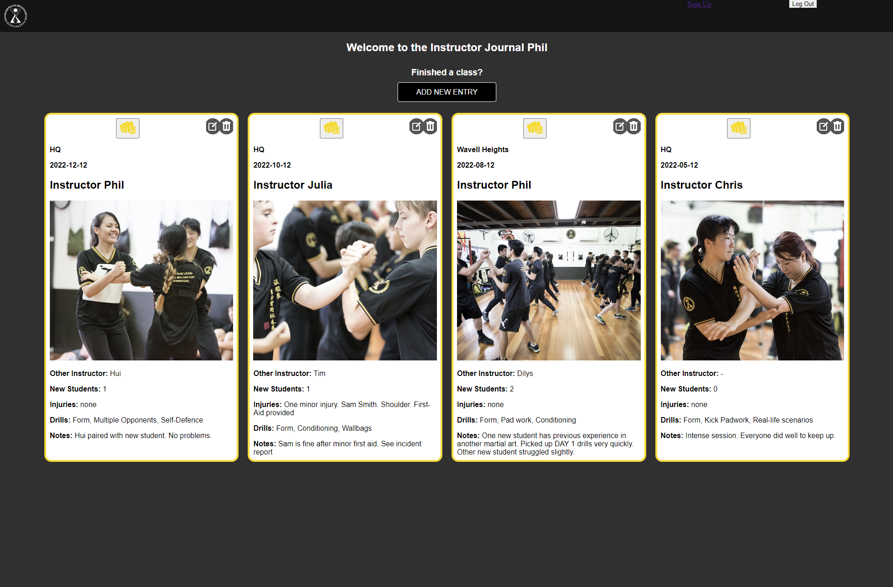

# Practical WingChun - Instructor Journal
The second project of my Software Engineering Immersive Course at General Aseembly. My idea for this app is directly related to one of my hobbies. I am one of many instructors at my martial arts school and the school is run on multiple locations throughout Queensland on different days.  
So the aim for this app is to allow the users(all instructors) to be able to plan, post and share what happens in the classes with the rest of the leadership group.   

Date Received: 13/12/22 
Date Due: 16/12/22

## :computer: [Click here] to see my live project!

## :page_facing_up: About
The below are the criteria set out by the course that I will need to meet:
### Technical Requirements
The app that I am building must:
- Have at least 2 resources(tables) (more if they make sense) – one representing someone using your application, and one that represents the main functional idea for your app
- Include sign up/log in functionality(if they make sense), with encrypted passwords & an authorization flow
- Have complete RESTful routes for at least one of your resources with GET, POST, PATCH, and DELETE
- Include wireframes that you designed during the planning process
- Have semantically clean HTML and CSS
- Be deployed online and accessible to the public

### Necessary Deliverables (Minimum Viable Product)
- A working full-stack application, built by you, hosted somewhere on the internet
- A link to your hosted working app in the URL section of your GitHub repo
- A git repository hosted on GitHub, with a link to your hosted project, and frequent commits dating back to the very beginning of the project. Commit early, commit often.
- A readme.md file with explanations of the technologies used, the approach taken, installation instructions, unsolved problems, etc.
- Wireframes of your app, hosted somewhere & linked in your readme (photos of your sketches on paper or whiteboard are fine)
- A link in your readme.md to the publically-accessible planning diagrams (eg. ER diagrams)

Extras
- Ability to upload images from user's computer/phone
- A library of drills/exercises that the user can choose from to plan their classes.
- Users can create their own drills
- Create admin permissions
 
## :pencil2: Planning & Problem Solving
### General Plan

I like to start off all projects with pen and paper. I think it lets me be more free and less constrained to ideas. 

Use the Problem Solving Process framework to break down the project into manageable components. From Technical Requirements & Necessary Deliverables
1.  Keywords 
    - 2 resources(tables) - database of user and other info(class details)
    - sign up & Login features
    - GET, POST, PUT/PATCH, DELETE routes
    - Wireframing or conceptual design evidence
    - Clean HTML/CSS
    - Deployed to public 
    - Using fly.io 

Wireframing / Conceptual Design of website - Used Canva  
  
  
  
  
  

2.  Tasks  
    - :white_check_mark: Create homepage
    - :white_check_mark: Create database
    - :white_check_mark: Create Sign up page
    - :white_check_mark: Create login page
    - Recent posts page only available to people who have logged in
    - Create Post page
    - :white_check_mark: Users can edit posts
    - :white_check_mark: Users can delete posts
    - Create like button for posts 
    

3.  Implement - Coding Journey and debugging.  
    Below are some "highlights" where problems arose and how I dealt with this problems.   

    ### Progress
    
    At this point I am able to create and update journal entries. One thing to note is the date is not in the format that I like. I will have to deal with this a little later. 

    Thinking about the app and its purpose, it actually does not make sense to have a sign up page. To give a bit of background to the school, a student can only become an instructor after proving that they are at a sound level and is able to communicate effectively and give guidance to other students. They are then put through an instructor program to build on those communication and coaching skills.

    Therefore, this leadership group is private and this app would not require a signup as the admin or Sifu would be the one registering the instructor for the app. Perhaps then we will create a sign up/create user page but only seen for users with the admin role. This will prevent anyone from the public to be able to sign up and use the app. 

    I will go ahead and create the sign up feature for now, and work out how to only show it for the admin later.   
      

      
    Created an admin column in the user table of my database. This will allow me to single out any admins. They will have additional permissions like edit/delete all posts and also create new users. 
      

      
    Sign up and Login function implemented. Next steps is to create the page that the public will see. Only instructors who log in can enter the app and see the homepage. 
    I also need to create a log out button. 
      

      
      
    Public Only landing page implemented. Only users who log in can see what the app looks like. No sign up functionality as the school is private. Will create a link to redirect users to the official school's website though.
       

      
    I struggled very hard with the landing page. I wanted to make the background image transparent with a bit of dark tint added so that the text and logo pops out. However it was through trial and error and a lot of googling to find that once the text is a child of the background container which is transparent, the child will also be equally transparent. 

    With the amount of time spent on this, I figured I would use my previous design skills and apply the right tint to the background image using photoshop. 

    The logo, text, and button still took a while to position correctly. However, the final result looks exactly how I wanted it to look.
      

      
    One of the most frustrating things thus far was getting the edit and delete icons to work and sized correctly. In the process, somehow my Signup and Log Out button and link is now unstyled. 
      

      
    Journal entries limited to 4 on the home page. Also added a "like" button for each of the entries. Will need to fix styling issues. 
      

      
    Add new entry, edit entry, and sign up pages all styled. 

      
    App deployed successfully! One thing that I did not consider was that once deployed, the database will be fresh. Since I do not have a signup page on the landing page, I had to temporarily create a signup button on the landing and created the admin login again. Then deleted the button. 
    ### For further details and complete code of the game, please feel free to click into any of the files in the repo.  

## :rocket: Cool tech
- Trello - For project management
- Canva - For Conceptual Design and graphics
- Ruby - Language used
- Sinatra - Backend framework on Ruby
- Bcrypt - Security
- PostgreSQL - Relational Database Management System
- Fly.io - To deploy full stack apps and databases

## :scream: Bugs to fix :bug:
- 

## :sunglasses: Lessons learnt
1.  Have to ensure the date style for Postgresql is set correctly.
2.  Do most of the CSS work BEFORE creating login sessions. Entering login details for CSS changes is a nightmare!
3.  Be mindful of not having a signup page on the landing page. If database gets wiped out for whatever reason, you will need to recreate a sign up button on the landing page, as the app is private.
4.  

## :white_check_mark: Future features
- 

